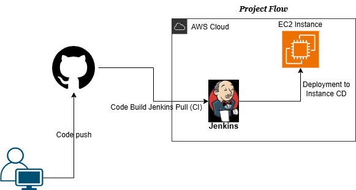

# Cloudfolio: Automated Portfolio Deployment using Jenkins CI/CD 

**"Automated once, deploy forever."**  -A creative cloud project demonstrating how to host and deploy a personal portfolio using **jenkins CI/CD Pipeline" and **GitHub** Integration.

---

## Project Overview

This project demonstrate how to **automate the deployment** of a **personal portfolio website** a using **jenkins CI/CD Pipeline**.

The setup integrates GitHub, jenkins and AWS EC2 to ensure continuous integration and delivery - every time you push code, ypur portfolio is automatically built and deployed.

---
## Flow

Developer → GitHub → Jenkins Server → AWS EC2 Instance → Live Portfolio Website.

---

## Architecture Diagram

---

## Tools & technologies used 

| Tool | Purpose |
|------|---------|
| **AWS EC2** | Hosting the Jenkins server and portfolio site |
| **Jenkins** | CI/CD automation tool |
| **GitHub** |Source Code repository |

---

## Project Setup Steps

### Step 1: Create your portfolio (Local System)

Create a Portfolio website using HTML, CSS. Test Locally using VS Code Live Server.

### Step 2: Push Code to GitHub

1. Go to GitHub and create a new repository : Portfolio-App-Deploy

2. Push your code .
3. verify your project files appear in the GitHub repository.

### step 3: Launch and Configure AWS EC2 Instance

1. Launch an Ubuntu EC2 Instance. 
2. update the instance and install Jenkins on EC2:
       
       sudo apt update
       sudo apt install openjdk-11-jre -y
       wget -q -O - https://pkg.jenkins.io/debian/jenkins.io.key 
       sudo apt-key add -
       sudo sh -c 'echo deb http://pkg.jenkins.io/debian-stable binary/ >/etc/apt/sources.list.d/jenkins.list'
       sudo apt update
       sudo apt install jenkins -y
- Start and enable Jenkins:

       sudo systemctl start jenkins
       sudo systemctl enable jenkins    

- Access jenkins at:
       http://<EC2-Public-IP>:8080

- Get the initial admin password:

      sudo cat /var/lib/jenkins/secrets/initialAdminPassword

### Step 4: Configure Jenkins
1. Install essential plugins: 
   - Git plugin
   - SSH Agent plugin
2. Add credensials:
  - SSH private key for EC2 instance

s
### Step 5: Jenkins Pipeline Configuration

1. Create a new pipeline project in Jenkins.

2. Select " Pipeline script from SCM"
3. SCM:Git
4. Repo URL:
      http://github.com/Abhinandan-58/Portfolio-App-deploy-CICD

5. Branch:Main
6. Script Path:jenkinsfile

### Step 6: Create jenkins Pipeline (Jenkinsfile)
 Use the following declarative pipeline script:

 
### Step 7: Access your deployed Portfolio 

After Jenkins completes the build and deployment:

- Open your browser and visit:
      http://<EC2-Public-IP>/

- You'll see your live, auto-deployed portfolio.

---

##  Benefits of This Setup

- Fully automated deployment process

- Eliminates manual file uploads

- Easy rollback with Git version control

- Scalable for future cloud setups

- Demonstrates real-world DevOps CI/CD pipeline

---

## Conclusion

This project shows how simple code can meet smart automation.
With GitHub, Jenkins, and AWS EC2, the entire deployment process becomes seamless — from local commit to live website in seconds.

“Automation isn’t just about saving time — it’s about creating consistency, confidence, and cloud readiness.”

#### Author
Abhinandan Patil.

Cloud & DevOps Enthusiast

#### Guided By: Trupti Mam
